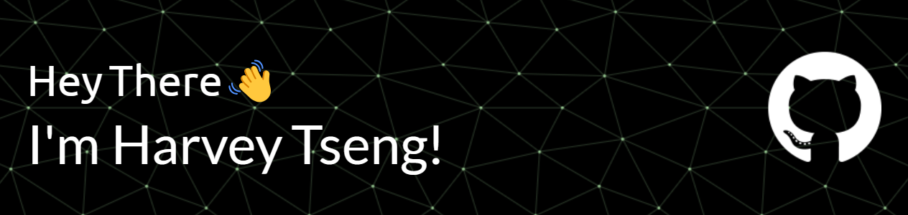

**I'm an aspiring Android Developer looking into integrating AI with Android!**

<h2> A bit more about me 😃</h2>

- :telescope: I’m working as a math tutor at SUNY Farmingdale
  
- :seedling: I'm currently learning Machine Learning with Python TensorFlow

- :zap: In my free time, I solve problems on LeetCode and try my best to keep up with Android's constant deprecations 😟

- :mailbox:Talk to me: &ensp; <a href="mailto:harveytseng2@gmail.com">harveytseng2@gmail.com</a>
  

<h2>Find me:</h2>
  

### :hammer_and_wrench: Languages and Tools :

<!--
**Verdenroz/Verdenroz** is a ✨ _special_ ✨ repository because its `README.md` (this file) appears on your GitHub profile.

Here are some ideas to get you started:

- 🔭 I’m currently working on ...
- 🌱 I’m currently learning ...
- 👯 I’m looking to collaborate on ...
- 🤔 I’m looking for help with ...
- 💬 Ask me about ...
- 📫 How to reach me: ...
- 😄 Pronouns: ...
- ⚡ Fun fact: ...
-->
